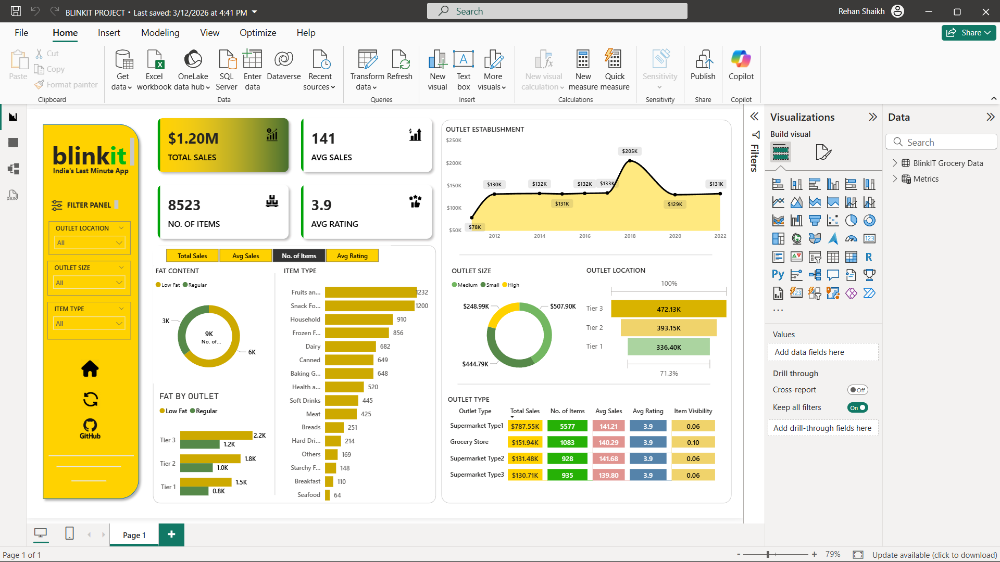

# Blinkit Sales Dashboard 📊

An interactive Power BI dashboard designed to analyze sales performance, customer demand, and product trends in a quick-commerce business.

---

## 🎯 Objective
To identify key revenue drivers and uncover actionable insights for business decision-making.

---

## 📊 Key KPIs
- Total Sales
- Total Orders
- Average Order Value (AOV)
- Category-wise Revenue Contribution
- City-wise Sales Distribution

---

## 🔍 Key Insights
- Snacks & beverages dominate overall revenue
- Tier-1 cities contribute the highest order volume
- Significant variation exists across product categories
- High demand for convenience-based products

---

## 🛠 Technical Implementation
- Data Cleaning & Transformation
- DAX Measures for KPI calculations
- Interactive filters and slicers
- Data modeling for efficient analysis

---

## 🖼 Dashboard Preview

---

## 📁 Files
- blinkit-sales-dashboard.pbix

---

## 👤 Author
Rehan Shaikh
